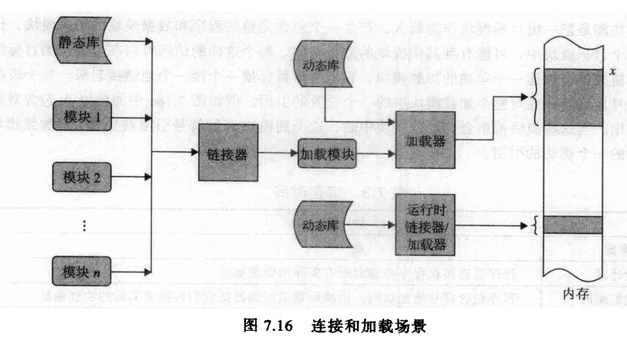

操作系统

目录

操作系统作用

设备编址

内存管理

进程管理

文件管理

外部交互

1.操作系统作用

最早的计算机是没有专门的操作系统管理的，只有一个作业程序输进去运行，此课程需要计算机组成预备知识。随着硬件复杂和作业复杂，产生了操作系统，用以通用管理硬件设备，并为程序提供通用运行平台。现在最常见的操作系统有用在服务器上的unix1970年，linux1991年，pc操作系统是windows1985年，移动操作系统android2005年，嵌入式操作系统和实时操作系统。

《操作系统精髓与设计原理》32、33页

操作系统的性能要求是资源利用效率，包括CPU、主存、外部交互等。研究硬件设备的应用有驱动开发，研究程序运行环境的应用有编译工程，本文重点研究最核心的进程调度。进程是程序运行时的实例。进程是计算机的运行单位，在内存有存储，在CPU有所属线程，在外部硬件设备也有分配相应的资源。线程是CPU的执行单位，CPU拥有CPU计算资源，寄存器存储，由相应的进程管理。一般一个CPU一次只能执行一个线程，有多余运算器的话可以多开一个线程。一个程序可以开多个进程，可以加速程序执行速度，难点在于通信协调。多任务处理也是由不同程序开多进程实现，。难点在于资源分配调度。操作系统通过合适的策略对进程间的调度切换，使得每一个计算机资源都能被充分利用。通过线程的调度切换，使得CPU充分利用。由于计算机资源中CPU更快更贵，大多进程的调度策略是累死CPU。线程执行完毕的时候会将寄存器的运算结果返回给内存，线程没有执行完毕就因为出错或者要给新线程让位而中断，需要将保存在寄存器中的CPU线程状态保存到内存，称之保存现场，以待继续执行线程的时候恢复现场。现在的CPU常见频率有3GHz，线程的切换只需要几ns。进程的数据量大，切换更久一点。操作系统通过频繁的进程切换和线程切换，让每一种计算资源处于忙的状态，不让某个任务等到某个资源的释放才执行。

38页

《操作系统精髓与设计原理》48页

现代的操作系统基本不允许程序直接访问硬件，而是由操作系统管理，给上层程序提供抽象化的服务。操作系统可以以内核态运行，取得计算机所有权限，一般程序以用户态运行，权限由操作系统管理。

2.内存管理

操作系统启动的第一步就是加载设备，给设备编址，尤其是给内存编址。内存编址首先要将地址一维化提供给程序使用。一块内存的晶体管会横着排列或竖着排列，还可能有多块内存甚至虚拟内存或者分式系统中其他计算机共享的内存，标记地址不会设一组数据，先声明哪台计算机，哪一条内存，第几行第几列的某个位置。操作系统将其抽象成一个一维地址，看起来就像是线性排列一样，称为逻辑地址。操作系统给程序提供了一个内存抽象层，遮蔽了内存间的差异。程序中的内存地址都是逻辑地址，输入输出时候再由操作系统自动转换为具体地址。

1g内存有2\^(10+30+10)=10亿个字节，大概需要86亿个晶体管。还好操作系统只需要给其中的字节编址，再整个字节提取。即便如此，字节数量也高达10亿个。按字节分块也不够，还要在对字节分块，内存中的分块单位叫页，常见的页大小是几十kB。操作系统建立少量的页表即可索引广大内存。内存管理的颗粒度是页，Windows中硬盘格式化NTFS一般选4kB分配单元大小，二者很像。抽取的常用页表存储于缓存中可以大大加快查找速度，利用局部性可以讲缓存的命中率达到90%以上。

进程创建时，操作系统和分配数个专属内存空间，分配一整块内存简单高效，但奢侈。实际办法是分为数段，每段内地址连续。根据进程需求大小不同，还可能动态调整大小。一个进程也有一张段表，标记该进程分配有哪几个段；每个段有张页表，标记该段占用了哪些页。操作系统既要保证不同进程间段的隔离性，也要节省页的使用，这种段页式管理内存方法要求高效的算法分配。

《王道论坛考研操作系统2017 》154页

内存的加载过程

《操作系统精髓与设计原理》 228 229页

上图成为绝对家加载，一次性把所有程序和数据内容加载到内存中。更常见的情况是加载过程中会有很多引用库，编译的时候写入相对地址，开启进程的时候再有操作系统分配具体地址，有时候还引用外部文件。也是由操作系统分配空间。具体的算法有首次适应、最佳适应、最坏适应、临近适应算法。

为了省内存空间，会将加载的空间分为固定区和覆盖区，固定区的段常驻进程，覆盖区的段不用的时候写入外存，要用的时候再读回来回来，这个一个程序内部的内外存调度分配称为覆盖技术。如果是进程之间需要切换内外存，常常是优先插入或者等待原因，则会将一个进程整个换出到外存。，称为交换或者对换。更进一步地，将外存划分出一块专供内存换出，称为虚拟内存，在程序看起来内存扩展了。活动的进程放在真实内存中，内存满则将不活动的进程换出到虚拟内存中。页面置换将活跃性的进程都保存在真实内存中，将不活跃的内存置换到外存中，利用局部性原理，预测准确读可以很高，效率提升明显。局部性是指某些部分的数据更可能在下一步被访问，尤其是时间上排在一起的或者空间上排在一起的数据，提前一次性批量加载准备，很有可能用得上，实际效果很不错。具体的算法有淘汰无用页、先进先出、最近最久未使用置换、时钟置换算法。

3.进程管理

需要执行一个程序时，CPU读取程序代码和数据加载到内存中，由操作系统分派器（调度器）开启一个进程，不够的话多开几个。一个进程等到所需条件成熟会分配给CPU执行，不成熟则处于阻塞状态等待外部条件如加载I/O等。如果遇到其他进程切换要占用CPU，还会暂时挂起，推出CPU保存现场到内存中。

《操作系统精髓与设计原理》82页

《王道论坛操作系统2017》 31.页

标识进程的进程控制快PCB如上图。操作系统最深邃的部分在于多进程，包括进程切换、进程通信，以及死锁。相较于进程切换，线程切换更常用，CPU速度快，
寄存器的数据量很小，所以线程切换快，线程将输出数据反馈到对应进程中，实现简单。进程之前为了相互协作或者竞争独占资源会通信，实现的办法有硬件标识、共享存储、消息传递、管道文件通信。

进程的调度除了手动指定优先级外，操作系统自动调度考虑的指标有CPU利用率、系统吞吐量、周转时间、等待时间、响应时间。典型的调度算法有先来先服务、短作业优先、优先级调度、高响应比优先调度、时间片轮转调度、多级反馈队列。

4.文件管理

文件是持久化保存数据的形式。计算机运行基本单位是进程，、交互的基本组织单位是文件。文件系统中，单个数据元素叫数据项，包括属性名称和属性值。一条记录包含了一组相关的数据项。由记录按照一定结构组织的文件称结构文件，无记录组成的文件叫流式文件。大多文件都有结构，有一定独立性，可以被多个进程访问，跨平台访问。数据库是结构严谨的文件，常常做成服务形式对外提供。文件的基本属性有操作系统编排的标识符、名称、类型、大小、权限、位置、时间，基本操作有创建、写入、读取、查找、删除。文件的编址方式有顺序、链式、索引、散列。目录中包含许多下属文件，是通过该目录包含下属文件的链接地址实现的。

Linux中常见的磁盘格式是ext4格式，windows中是fta32和ntfs格式，分块大小各不相同。磁盘格式化是指将磁盘按照一定格式排列，通常只是在磁盘头声明格式，需要写入磁盘时候再真实写入。删除文件也删除链接地址，不会真正删除数据部分。若想擦除数据应该选择低级格式化。

磁盘的文件分配比内存中的进程分配宽松许多。磁盘位很密集，不设冗余，有坏道会标记。灾备的办法常常是多设磁盘。

《王道论坛操作系统2017》 229

5.外部交互

《操作系统精髓与设计原理》

计算机的外部设备不仅慢，速度还相差甚远。据称96%的进程时间都是在等待外部设备，引发进程中断。为了匹配速度间差异，一般采用缓冲池技术，计算机内部与缓冲池通信，缓冲池再与外部设备交互。下图才是外部设备的日常。

《王道论坛2017 》264

《操作系统精髓与设计原理》

集群计算机可以由多台计算机并行处理，增强计算机能力。通过集群中间件，使得程序运行像在一台计算机上。

补充书目：《操作系统精髓与设计原理》
