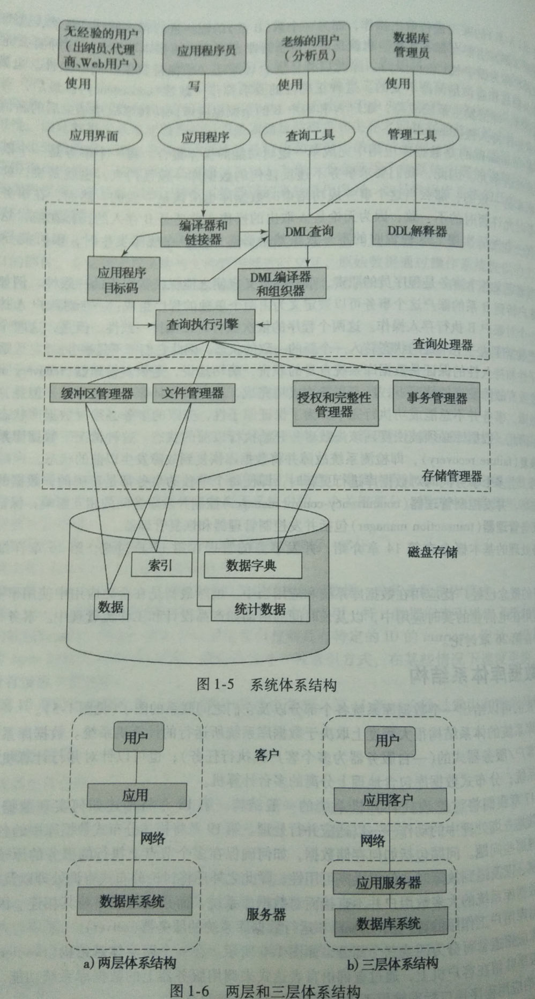

数据库

目录：

数据库是结构化的文件

关系型数据库

基本数据库操作

数据库体系

查询

设计分析

数据库实现

可靠性保证，约束、触发器、日志、事务 恢复

高级特性

1.数据库是结构化的文件

持久化的数据称之为记录，在持久化存储器中，记录的最普遍形式采用文件，文件仅仅有操作系统规定了控制域结构，装填有效信息的数据域不做要求。件的内部的数据域不必需结构来组织信息，控制域由操作系同编入文件名、文件格式、文件大小，文件位置、创建时间、权限。寻址上有顺序、链式、索引、散列。文件作为普遍的底层记录形式很适合，实现简单，操作一般只有创建、删除、打开、关闭、读取、写入。如果要频繁快速地实现数据的读写，就有必要规定文件的数据域结构了，数据库一般把数据部分的信息存储与于同格式的元组结构，结构化的文件会付出一定编码和空间成本，不需要装填整个文件，直接找到需要读写的信息部分实现快速高效的读写目的。数据库的工作就是用尽可能低的结构成本实现最高性能的读写。在今天，数据库居于核心的数据存储地位，除了高性能之外，可靠性也是重要目标。常用的开源数据库系统有mysql/mariadb,
Postgresql，商用数据库有Oracle、IBM DB，MS SQL SERVER。

2. 关系型数据库

在195x年就有数据库了，硬件条件所限，早期的数据库跟操作系一样也是不通用的，出现过层次、网状数据库，很多模型设计模仿现实中的数据关系，也很复杂。1970年Oracle根据IBM研究院的论文设计关系型数据库，通用切高效，至今仍是主流模型。关系型数据库主要用表承载信息，表类似于表格，每一行的结构相同，这种共用的结构模式叫元组，一个元组由多个维度上的元素依次组成。元组是抽象模式，行记录是其具体实例，字段是维度的具体实例。表中每一行都表示一条记录，数据库的基本操作单位就是一条条记录，行记录之间的独立无关系。每一列就叫一个字段，维度的名称叫字段名，常常放在首行，维度声明此列的可以存储的数据类型，如数字、字符串、日期时间等。常用选中或者新设一个或者数个字段来标识行记录，叫做码，或者主键。一张表里面的主键值自然是各不相同，需要与行记录满足一一对应的关系，常新设一个id或者身份证号等字段。两张表之间的关系靠共同的字段来表示，称为外键。表的结构非常适合表示重复的相同结构的记录，为了满足这种结构性，会产生很多空值。常常一张表存储一个实体的诸多实例，两张实体表的笛卡儿积存入新表中，可以表示实体之间的关系。由此达到了结构上的统一。结构性越严谨，效率越高，占据的存储空间越大。一个好的设计需要根据具体场景选择。

练习：搜索安装WinNMP，点击HeiDeiSQL连接数据库，找一个体积最大的表，看看表的结构和里面的数据，看看最下一行的状态栏有什么变化。在安装目录附近寻找数据库文件的实际位置。

3.基本数据库操作

相互联系的表构成了一个数据库，可以独立地表示显示世界中的数据关系，称之为一个数据库或者目录。操作数据库和表的结构成为数据定义语言，对行记录增删改查成为数据操纵语言，通用SQL语言实现。

为了维护数据库的结构，数据定义语言要要对数据的操纵给一定约束规则，常见的有not
null,unique,check(Gender in (‘男’，‘女’,’其他’)); primary key(column1); foreign
key(column2) references table2;

通常一个系统用一个数据库，给予管理员、开发员、运营的数据库不同的权限。将各种资源的操作抽象为权限，将各种用户抽象为角色，在角色与权限之间设立少量的规则。

数据定义语言频次较少，权限要求高，可视化工具简便直观地实现。

数据操纵语言是程序员的日常用语。最常用的是增删改查语句：

-   查询：SELECT Column1, Column2 FROM Table2 WHERE
    id\>9;//SQL大小写效果一样，实际常用大写跟变量名称区分。

-   增加：INSERT INTO Table1(Column1, Column2) VALUES (cell1,cell2);

-   更改：UPDATE Table1 SET Column=cell1 WHERE id=’4’;

-   删除DELETE FROM Table1 WHERE Column1 LIKE “邬%;”//邬%;表示邬%开头的字符串.
    %在这里通配任意字符串,?表示任意字符。

练习1：HeidiSql中建立新数据库、新表，填入数据，用sql语句增删改查。

练习2：上述查询语句等价执行语句如下，依次写出其他sql命令的等价执行语句。

foreach rows in Table2{

If rows[‘id’]\>9,{

print(Column1, Column2);

}

}

4.数据库体系

下图是一个完整的数据库体系，数据所在的物理层，有查找索引，读写缓冲，权限检查。数据库引擎负责操纵这些行记录，内置一些内部函数和执行命令，上层的业务逻辑层代码会翻译成数据库引擎的内部指令执行。有时候原子性需要数个数据操纵语言保证，数据库引擎中由事务实现。还有一类虚表叫视图，本身不存储数据，而是由实际存储数据的实表选择数据展示的，在实表与用户之间建立了一套抽象层。

《数据库系统概念》图14页

5.高级查询

Select 语句的完整版： SELECT Columns FROM Tables WHERE Conditions GROUP BY
Column HAVING Condition2 ORDER BY Column ACS/DESC;

执行次序：

>   1 from 子句

>   2 where子句

>   3 group by子句

>   4 having子句

>   5 select子句

>   6 order by子句

where 条件中可以跟多个逻辑语句，谨防WHERE condition OR true AND name LIKE “%?”;

having与where条件类似，where在查询前判断条件，having在查询结果中根据铁剑选择展示。

group by column将结果按照column值分组。

表的来源不必须是实表，也可以是select的虚表，从上一条select于是产生的结果表中再次查询，称为嵌套。这个临时结果表和字段可以用AS起别名代称。

UPDATE table1

SET Frequency=null;

UPDATE table1, (SELECT id, count(\*) AS Column2 FROM table1 WHERE
length(trim(Company))\>11 GROUP BY Company ) AS table2

SET tabel1.Frequency=tbale2.Column2

WHERE table1.id=tbale2.id;

SELECT Company, Frequency FROM cdsgus ORDER BY Frequency DESC;

这是一个典型的练习语句，先清空字段，再更新，最后查询检验效果。请写出其执行顺序。

临时表也可以用join on拼接，跟笛卡尔积不同， 结果是左表右表根据外键值拼接。

SELECT \* FROM student JOIN takes ON student.id=takes.id;

等价于

SELECT \* FROM student， takes WHERE student.id=takes.id;

常见的高级查询还有exist，in，with 语句。嵌套查询花费巨大，尽可能优化工作量。

不同的数据库有自己的内置函数，mysql常用的有top
100，count，length，trim，avg(average)。下面语句用上了正则，集合检查、字符串提取，选出最小众的100个邮箱域名。

SELECT TOP 100 substring_index(trim(EMail),'\@',-1)
,count(substring_index(trim(EMail),'\@',-1))　

FROM tbale1WHERE Email!=''

AND !find_in_set(substring_index(trim(EMail),'\@',-1),
"待定,qq.com,163.com,hotmail.com,sohu.com,126.com,sina.com,qq.com,hotmail.com,tom.com,yahoo.com.cn,yeah.net,189.com,sogou.com

,139.com,gmail.com,189.cn,yahoo.cn,yamil.com,foxmail.com,yahoo.com,msn.com,21cn.com,263.com,263.net,sina.com.cn,jj.com"
)

AND EMail REGEXP
'\^[a-zA-Z0-9][a-zA-Z0-9._+-]\*[a-zA-Z0-9_-]\@[a-zA-Z0-9][a-zA-Z0-9._-]\*[a-zA-Z0-9]+..[a-zA-Z]{2,4}\$'

GROUP BY substring_index(trim(EMail),'\@',-1) ORDER BY
count(substring_index(trim(EMail),'\@',-1)) ASC;

6.设计分析

常常一个实体放进一张表中，关系放在另一张表中，如果关系表的记录不多，也可以放进实体表中。各个字段的读取修改频率不同，影响大的话需要分表，将一些低频字段放进别的表中。定长的字段处理简单村迅速，变长的字段可以压缩存储空间。不同数据库，不同编码，字符的长度也不相同。

通常将相同模式的实体存储于一张实体表，实体间的关系存储于另一张关系表中。如果实体间是多对多、一对多关系，常常首选新表，若是一对一、一对少的关系，为了压缩存储也可以放进一张表中。如果是多个实体之间存在多元关系需要存储，规模在笛卡儿积级别，尽量拆表。数据库设计范式产生过第一范式、第二范式、第三范式、BCNF、第四范式、第五范式。实际中把握两个原则：

>   1.尽量贴近显示模型，自然码过于复杂则新建id作为主键。

>   2.字段之间尽量独立，不独立的字段另建新表存储依赖关系，尽量减小笛卡儿积。

>   3.根据数据变动来源、管理权限划分独立的表

数据库的设计依据具体场景而定，依赖经验分析。一般数据库模式设计完成之后不再变动，十年八年都不升级。所以设计系统首选数据存储方式，哪些用于文件存储，哪些用数据库存储。频繁使用字段分表存储，数据量太大则分段存储，读写不匹配则专门设置读写数据库服务器。一般运行数据库引擎的计算机叫数据库服务器，可供千百个连接读写服务。每一个连接会对占用的数据段加锁。尽量避免由数据库运算，而应该程序将结果集提取出来再分析。Mysql的默认端口是3306，默认密码为空。

而今有文件型数据库sqllite，内存型数据库，nosql适用于丰富的场景。

7.数据库实现

数据库的基本构成是行记录，这样的行记录可多至万亿条，数据库引擎的工作就是在这茫茫大海中找到想要的一粒沙子。编址跟寻址调度上的性能要求相当高。编址上会有b树，多级索引，多个字段索引，散列等，极端的还有位图索引，一个位表示这个地址是否存在。寻址调度上有电梯算法，整块载入，尽量一次查找成功。

USE hotel CREATE index EMAIL on table(EMail);

Mysql中这一句给EMail字段添加了索引，mysql将行记录重新按照Email排列，以后按照email查找会很迅速。

从一个查询到一个逻辑查询计划：

>   SQL查询语句

>   语法分析器

>   预处理器

>   逻辑查询计划生成器

>   查询重写器

>   选中的逻辑查询计划

对于每一步操作，要分析其查询行记录的工作量，尽可能早地排除无用数据，实现耕地代价。数据库引擎将查询结果集存入缓冲池，释放资源锁定，缓冲池将结果集反馈给程序。

8.可靠性保证

今天数据库占据着核心存储位置，可靠性甚至要优先于高性能。数据库实现可靠性有对于行记录中字段取值范围的约束，这写入表结构中，数据库引擎会自动检查，不符合的数据会拒绝注入。触发器用于设定特定规则，达到触发条件会引起一定操作。日志记录数据操作的轨迹，先写入日志，在写入数据库记录。断电等灾难后的数据库恢复以日志为准。日志的恢复需要手动操作。

有时候构成单元操作必须数条sql命令和条件，数据库中用事务实现，中间有中断会自动回滚至初始状态。事务实现了操作的原子性、一致性、隔离性、持久性。原子性表示数条基础操作不可分割，一致性要求执行一个事务的时候数据库不变，隔离性要求事务之间互不干扰，持久性要求事务的完成对数据库的影响是永久的，即便系统故障。

9.高级特性

为了保障数据库的安全，物理上有灾备，冗余备份，双器件。数据库上封锁远程访问，锁定ip访问，分配权限。查询上防止sql注入，恶意查询，DDos。

优化上除了sql语句层面调优，还有数据库设计优化。顶级公司会设计数据库引擎。比如采用postgresql作为基础数据库，自己开发缓存池、锁工具等。

最高端的是分布式数据库，将数据库分别存储与多个主机中，再写一套中间件连接，单点故障不会影响全局。即便是内部拖库，或者物理破坏，也会因为流量等监测报警而将危害控制在局部范围内。
