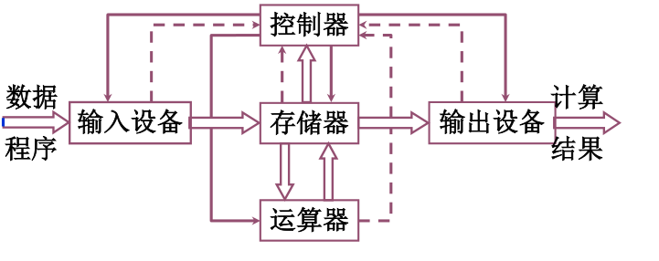
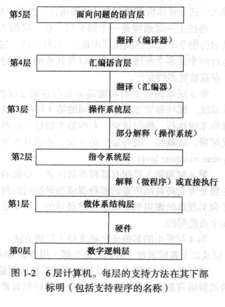
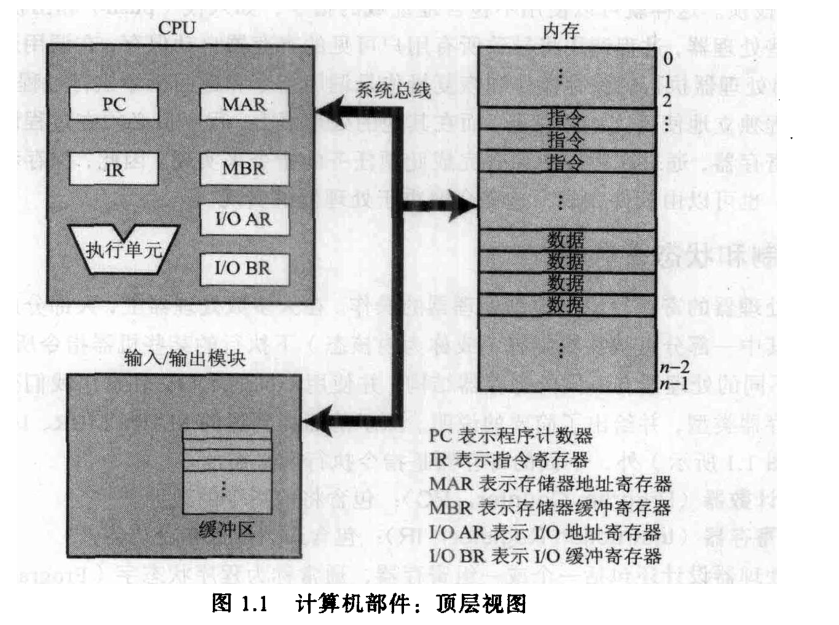
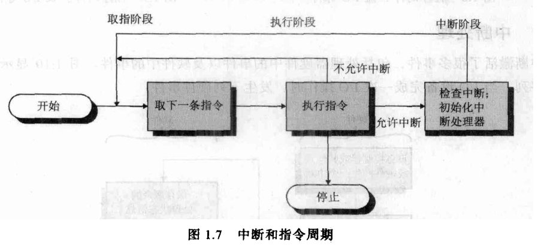
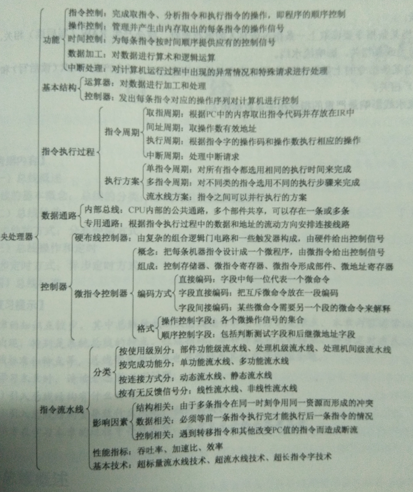
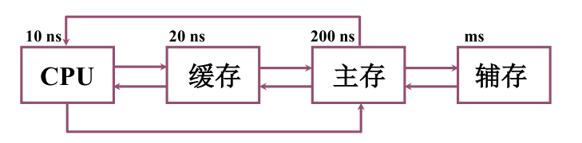
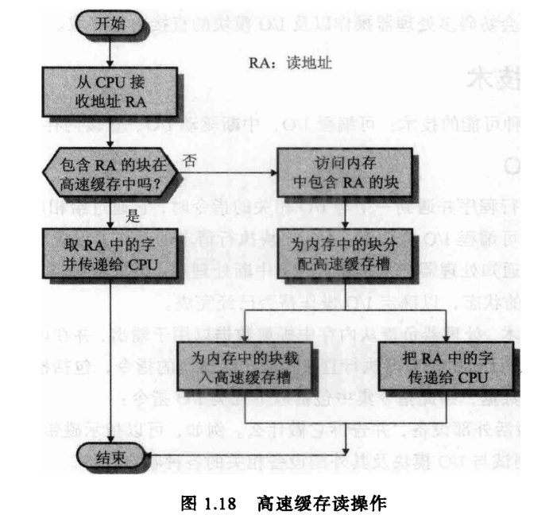
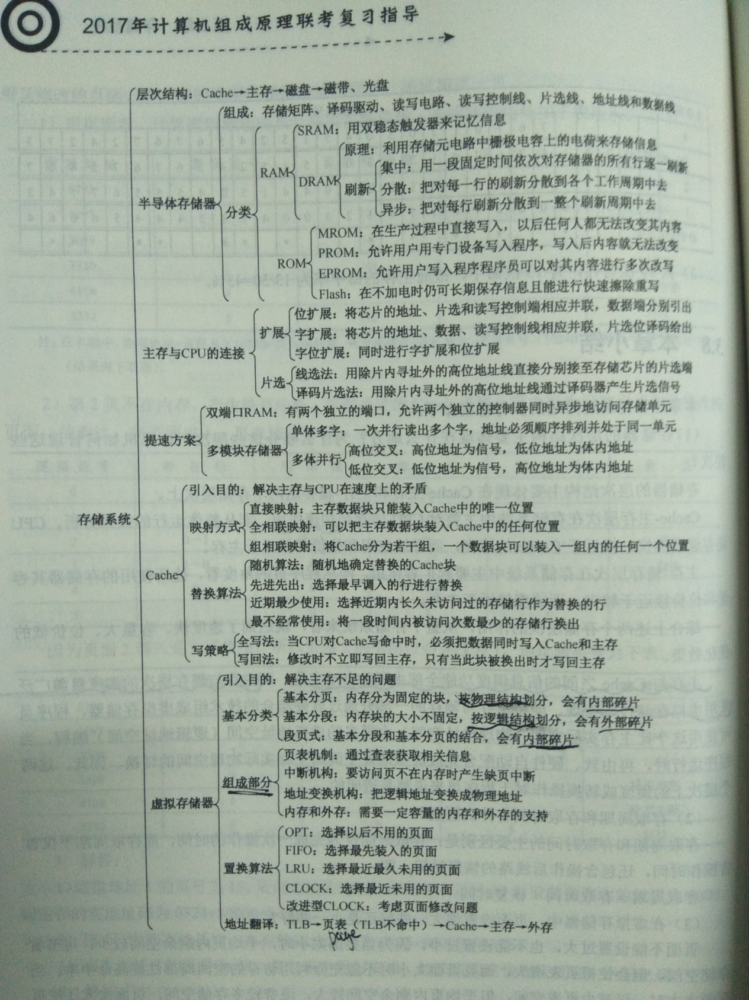
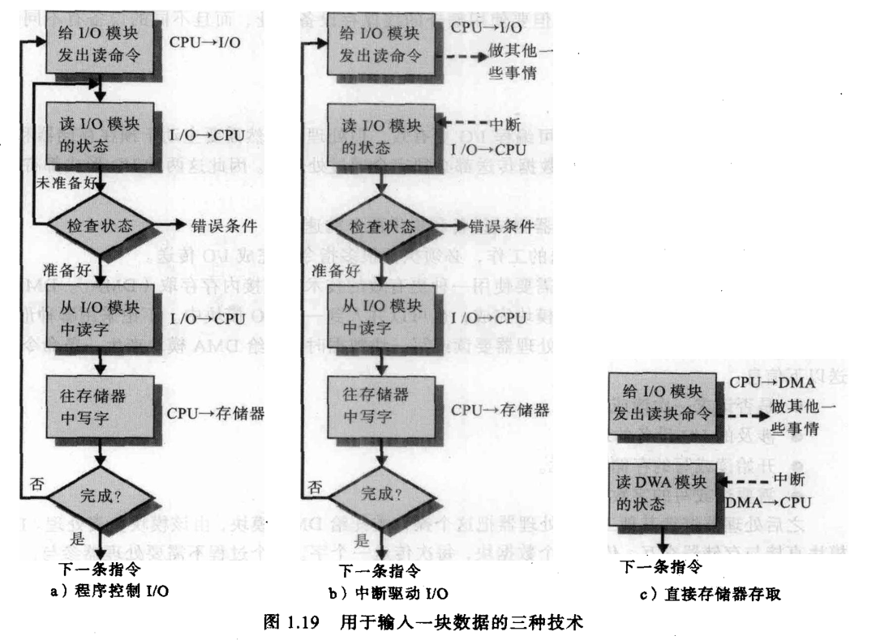

计算机组成

目录

一个计算机原型

计算机的组成

计算机的结构

CPU的结构

存储器体系

抽象指令集

外部设备

计算机，是用于计算的机器，计算是设计目的，机器是实现载体。学名是电子数字式通用计算机，简称计算机，俗名电脑。起源于机械计算工具，1946年制成电子计算机，如今分为个人计算机、嵌入式计算机、大型机、集群等，至今广泛应用于移动的、家用的、高性能的各种场合，是IT社会的基石。

1.  一个计算机原型

**复写器**

我们设计一个计算机原型，有输入，有输出。首先设计一个复写器，通过纸带输入输出。设备有：

输入纸带：格式化纸带，有8格，每格表示一位二进制数字。空白用0标记，打孔用1标记。比如1110

读取针：带灯泡和光敏半导体，纸带位于灯泡和光敏之间。如果纸带该位置是有孔，灯泡的光会射到光敏半导体，读取针产生电流，信号为1；如果纸带没有被打孔，没有电流，读取针信号为0.通过电路连接到控制器。

输出纸带：格式化的空白纸带，八位长就是0000 0000.

打孔针：有一个电流刺激信号可以给输出纸带的一位打一个孔。

电路板：虽然只有一根导线，有什么电流信号传输什么电流信号，但在抽象意义上，它是一块电路板，输入设备输出设备都跟它相连。

电动机：输入纸带与输出纸袋都连接电动机，电动机有电流激励，则转动纸带，针的位置相对于纸带前进，到纸带尽头停止。

电动机没让纸带移动一格，读取针读取一次，打孔针执行一次，称为一个周期。要描述这个复写器的状态信息只需要二维信息，一个是读取针的值，一个是打孔针的值。读取针的值由输入纸带确定，读取针的信号会传递至总线，总线把读取针信号传递给打孔针，打孔针打孔或不打孔，一个周期执行完毕。从电动机转动开始，经过八个周期，输入纸带上的数据可以一模一样地复写到输出纸带上。

**加一器**

复写器只有复写功能，现在升级一下，做一个加法器，给输入数值加一。对于二进制数字来说，0+1=1，1+1=10.还需要一个寄存位。设备如下：

输入纸带：7位，最后一位留空。读取针产生的值称为输入值。

输出纸带：8位，比输入纸带多一位，用于进位。打孔针产生的值称为输出值。

电路板：连接读取针、打孔针、寄存位

寄存位：可以被电路板读、写，只能存储一位。这个寄存位用纸带实现不太方便，用磁芯实现，配一个读取针、一个写入针。

电动机：带动输入纸带、输出纸带。

每一个周期内，输入纸带、输出纸带移动一格，读取针读取一次，打孔针执行一次，寄存位读取一次，寄存位写一次。描述这个周期需要的信息由：输入值、读寄存位、写寄存位、打孔值。写寄存器位1表示需要更改寄存位的值。将寄存位读取值、是否写入改为寄存位旧址、新值更直白，则一个周期中，寄存位新值和打孔值可以有如下规则确定：

读取值 旧寄存位 新寄存位 输出值。

0 0 0 1

1 0 1 0

0 1 0 1

1 1 1 0

加一器算是特定用途的电子计算机，使用电子器件计算数字信息，有独立的输入设备、输出设备，有个模糊的内存，运算器和控制器的概念还比较简陋。可以看出计算机适宜结构化地处理有限的离散的数字数据。

思考：如果要加四，加一器执需要执行多少个周期，怎么改进设计？加一器能实现乘法吗？

1.  计算机的组成

计算机是用机器来实现计算的，计算机发展史上最重要的两个先驱是计算齿轮和穿孔卡。计算齿轮将计算过程使用硬件实现，大大加快了计算速度。穿孔卡最早在纺织机中用于控制花色，后来写有指令的穿孔卡引入到机械计算机中，为计算机提供了程序控制基础。二者的结构诞生了计算机，后来电子器件代替了机械计算期间，速度飞跃，称为电子计算机。这些机器设备统称为硬件，操纵这些硬件的抽象程序称为软件。硬件软件在一定程度上可以相互替代，如果频繁的、简单的、要求高速稳定的程序常会使用硬件实现，偶尔的、复杂的、灵活的、要求低的算法用软件实现。

| 输入设备 | 控制器       | 运算器   | 存储器     | 输出设备 | 外存   |
|----------|--------------|----------|------------|----------|--------|
| 手柄     | 穿孔卡织布机 | 计算滑尺 |            | 机械     |        |
| 摇柄     | 穿孔卡       | 计算齿轮 |            | 铃铛     |        |
| 按键     |              | 差分机   | 穿孔卡     | 穿孔卡   |        |
| 穿孔卡   |              | 分析机   |            | 打印机   | 穿孔卡 |
|          | 电路         | 继电器   | 胶片       | 灯泡     |        |
| 键盘     | 插板         | 真空管   | 继电器     | 显示器   | 磁鼓   |
| 鼠标     | 电路板       | 晶体管   | 电容器     |          | 磁带   |
|          |              | 集成电路 | 晶体管内存 |          | 磁盘   |

发展的趋势是运算速度越来越快、存储信息越来越大、交互手段越来越多、控制器件数量越来越多。现在CPU的频率可以达到4GHz，朝着并行计算和低能耗的方向发展。随着存储器的发展，计算机已经由运算器为中心变为以存储器为中心。希望将来能直接以数据为中心。

练习：搜寻几个重大的软件硬件，统计其速度、空间数量级

哈工大 刘宏伟

1.  计算机的结构

计算机发展到今天已经很复杂了，形成很明显的分层结构。分层的好处是每一层只需要负责本层的部分任务，向上一层提供其需要的抽象服务，屏蔽不必要的细节，大大简化了计算机的结构设计。每一层都用本机的语言来解析执行上级的指令。初级程序员只要求在高级语言层面编写程序，学习更低层次机器有助于优化代码。最底层的数字逻辑是电子工程师设计的，如0、1信号的电气表示、门路的逻辑设计。微程序是一组基本期间实现的基本程序，常见的有加法器、浮点计算器等。指令集更高一层，集成了最常用的几十条CPU命令。再上一层是操作系统，
用于管理计算机资源和抽象一些通用程序。汇编语言实现一些低级操作。更多的应用程序时由高级语言写的。一个应用程序的启动，需要操作系统分检查的的依赖库和链接参数，分配一定的计算资源，生成操作系统指令，机器把操作系统指令翻译成CPU指令执行。数据的流向是输入设备的输入数据加载到内存中，CPU每个周期都是读取，通过不断的CPU指令调取内存数据到CPU中运行，将运行结果反馈给内存，再由内存输出到外部存储设备。总线连接着CPU、内存和外部设备，现在的计算机都有多跟总线连接多个设备。总线由数据总线、地址总线、控制总线几类构成。计算机中的所有信息都是用二进制的电气信号表示，各种设备也要靠编号识别，称为该设备的地址，过程称为编址，寻找设备的过程称为寻址，这个设备可以是一个硬盘片，也可以是内存中一个变量的一小段，还可能是其中某一位。一般说它的地址是其开始的地址，而不说它所占的范围。总线有串行通信也有并行通信，好的器材才能上高频的串行通信，并行通信的问题是要防止互相干扰。

| 层级     | 举例          |
|----------|---------------|
| 应用程序 | QQ            |
| 高级语言 | C、java       |
| 汇编语言 | intel汇编语言 |
| 系统软件 | 操作系统      |
| 机器语言 | 指令体系      |
| 微程序   | 控制系统      |
| 数字逻辑 | 电子线路      |

《计算机组成 结构化方法》3页

1.  CPU的结构

由于CPU运行速度很快，控制器很大一部分已经跟运算器封装在CPU中。CPU中的组成由时钟、运算器、编码器、解码器、控制器、寄存器、接口等组成。其基本组成原件是集成电路中的晶体管。电路直接传到原样信号，一个二极晶体管加上最基本的反转器形成非门，两个晶体管加上反转器构成与非门和或非门。与门、或门需要三个晶体管，更复杂。所以有品味的码农会尽可能地利用晶体管。一个普遍编码风格就是默认的电平或者状态表示0，要改变才表示1.。计算单元擅长处理位比较、移位、整数加减法，浮点、乘除法、图像等计算需要复杂得多的电路。电路的简化需要用到逻辑的知识。每一个周期中，CPU不断读取指令寄存器中的指令、地址寄存器中的数据地址，交给计算单元执行数据操作计算的任务，并将结果反馈给总线。对于一个运算器而言，输入输出的是整数字节的指令和地址两种类型数据，通过电路直连对应的寄存器。

CPU的晶体管数量、时钟频率、架构和指令集决定着计算能力。现在的家用CPU集成了几十亿晶体管。有专门的地址运算器、指令运算器、加法器、乘法器、浮点计算器、图形计划其、多媒体计算器等以及相应的寄存器。CPU常常会多设冗余运算器，依赖可以实现多线程，二来备用损坏。内存的晶体管数量巨大，十分密集，冗余少，相对CPU来说更容易出硬件故障。

《操作系统精髓与设计》7页

《操作系统精髓与设计》13页

由CPU内置的时钟部件提供时刻，每个时刻脉冲之间成为一个周期。每条指令执行时间以中期为单位，每个周期CPU不断从寄存器读取输入的数据和指令，并将新的数据和指令输出。

《王道论坛2017计算机组成》235

1.  存储器体系

根据速度与成本的衡量，存储从内到外分为寄存器、缓存、主存、辅存。速度相差数量级，容量和价格也是相差数量级。寄存器和缓存是封装在CPU中的，寄存器存储CPU运算单元计算过程中的临时变量，缓存cache加载了在可能被CPU读取的内存，提取的策略是局部性。局部性是指刚刚被访问过的地址附近更有可能下次被访问，缓存提前从内存提取，以供CPU下次读取。应用开发程序员不能操作寄存器和缓存，但会尽量让程序利用局部性，提高缓存提取信息命中率。一个1g字节容量的内存有2\^(10+10+10)=2\^30字节，需要总线、寄存器、运算单元都支持32位才能寻址到4g内存中的一个存储字节,再从改字节操纵其中的位。一个32位计算机是指计算机的指令长度有32位，一条指令一次可以指明2\^32个字节内存中的某一个字节位置，再将该字节整体取入寄存器运算。32位的最大识别范围是2\^(10+10+10)=4gb.要在更大的磁盘上的地址就要拆分了。计算机体系，包括CPU、内存、软件等，都是以字节为最小单位处理。在运算器内部运算时才以位处理。

寄存器、缓存、内存、固态硬盘都是由晶体管构成，结构略有差异。内存和硬盘之间也有缓冲层，内存有缓冲池，硬盘也有。内存在向硬盘交付数据的时候会先在内存还分一块待输出数据缓冲池，再从内存缓冲池交付到硬盘中较快的接收缓冲池中。当硬盘缓冲池写完清空的时候再向总线报告缓冲完毕。外存的容量很大，计算机体系不会因为这些大内存而提高字长，因为外存速度慢，分级编址多条发送也不在乎延迟。

哈工大 刘宏伟，图中缓存指CPU中的高速缓存。

《操作系统精髓与设计》

高速缓存与内存的协同如上。为了更快还可以同时向高速缓存和内存发指令，先到先用，不用再内存读取之前判断了。

《王道论坛2017计算机组成》144

1.  抽象指令集

这个抽象指令是通用概念，不专指指令体系。前两节了解了计算机的构件和基础操作，一组基本操作可以组成一个指令集，选取合适的指令集可以很好地抽象出一个简单的操作好的指令尽可能使用硬件实现、易于让底层操作译码实现、尽可能利用寄存器、其次内存。一个CPU指令流水线形如：取址单元-\>译码单元-\>取操作数单元-\>加法器等运算单元-\>回写单元。一般的PC指令集有几十条，分配给操作内存、操作寄存器、地址操作、运算操作。对于抽象层而言，下层相当于提供一些结构的虚拟机。操作系统封装了裸机，提供一些API给编译器。java抽象了各类计算机的指令封装成java虚拟机。如果内存不够用，将外存空间映射为内存地址，可以让CPU识别为内存使用，这就抽象出虚拟内存。并行计算中，将一个任务拆分成多条相同格式的指令并行处理，将合成结果反馈给程序，可以大大加快速度。并行计算的实际运算可能在不同的CPU和内存中完成，难处在于之间的调度。

原子操作。一个上层指令由几条下层指令构成。这几条下层指令不可拆分，称之为原子性。比如拆“北京大学人民医院”牌匾的时候，要么全拆，要么不拆，拆了“北京大”留下“学人民医院”，不符合原子性。

1.  外部设备

主要的输入设备由鼠标键盘、输出设备是显示器。丰富的外接设备有多媒体音箱、VR、游戏手柄等。网卡和显卡的性能提升速度很快

>   《操作系统精髓与设计》23

现在的计算机每个组件越发强大，其支持部件已经可以构成独立的计算机了，现在的家用计算机，内存有计算控制芯片，CPU也有存储，硬盘也有自己的计算芯片和内存。

补充书目：《计算机组成-结构化方法》
