计算机网络

目录

网络体系

链路层

路由层

主机层

网络应用

1.  网络体系

原始通信有驿站、烽火等，电气革命后又电报、电话。信息时代产生了网络通信，其中互联网通信无处不在，连接的主机百亿计量，都可以在秒内连接通信。网络为了计算机终端之间的通信而成立，通过一定介质和中介连接终端，终端通常是计算机主机。

最早的网络产生于终端登录，那个时候计算资源很宝贵，由多个终端接入计算机，轮到该终端的分配时间，在该终端输入数据，并从该终端输出数据，产生了最早的计算机通信。这个终端也可以连接其他的计算机。之后衍生成了计算机网络

电话通信采用电路交换，发起终端先呼叫，中介的交换机接入目标终端，建立独享线路后可通话，适用于即时通信、终端简单、简单的垂直网络。

电报和早期计算机广域网采用报文交换，主机发送的报文存储在传递中介中，再依次转发至目标主机。不会独占通信链路，没有建立连接过程，终端不要求同步，即时性弱，底层不可靠，要求中继计算机有数据处理能力高。

现今互联网主要采用**分组转发**，源主机将需要传递的数据包拆分成更小单位的帧，批量交付给路由器，路由器根据目的目标地址选择较短路径，目标终端在收到后返回确认帧。以此来保证传输可靠。分组需要额外的数据处理、控制、排队、传输，即时性弱，底层不可靠，灵活，中介低廉，线路利用率高，负载均衡。适合规模巨大复杂、水平主机多、即时性要求不高、需求突发，终端纠错能力强的互联网。

网络当然也追求即时性与可靠性，虚电路是一种常用实现办法，终端之间的链路采用分组交换，通过不断反馈和心跳维持连接，相当于虚拟出一条电路，不独占实际链路，保障正确性和即时性，缺点是需要处理更多数据处理。

分组交换是计算机网络的基础传播技术，将应用于每一层处理中。主机之间的消息传递，会经过通信介质和路由器等节点组成的链路，每一个分组的数据部分是上层交付的对本层屏蔽的信息，还要加上由节点管理的控制信息，通常加在数据部分前面，称为头部。

为了适用计算机网络这种终端强悍，主机数量众多，满足水平之间海量数据互相通信，设计出结构化分层模型，每层负责一定范围的任务。主机负责任务发布，主机之间采用IP地址识别，可全局寻址、软件定义。直接连接插口的设备记录硬件mac地址。封装的IP地址和mac地址采用路由协议适配，工作由路由器完成。主机的数据包分组生成后传递给下层，下层加上带有控制信息的头部或者尾部交付给更下一层。最终由底层传输给中继下一站，最中目标主机接收时，层层去掉底层封装信息，重新组合成本层数据包。有错误或遗漏会重传。

基础底层承担最多的数据量，要求传输快、简单检测，中间路由层要求硬件便宜、路由最短、适配软件地址和硬件地址，复杂的纠错和应用放在终端主机。

OSI是学术分层，比较细致。TCP/IP体系是业界常用，五层协议是教科书常用。本文采用三层体系。

常见互联网分层体系

| OSI体系结构 | TCP/IP体系结构 | 五层协议体系结构 | 设备   | 协议              | 协议数据单元PDU                  | 寻址方式    |
|-------------|----------------|------------------|--------|-------------------|----------------------------------|-------------|
| 应用层      |                |                  |        |                   |                                  |             |
| 表示层      |                |                  |        |                   |                                  |             |
| 会话层      | 应用层         | 应用层           | 进程   | HTTP、FTP…        | 报文message                      |             |
| 运输层      | 运输层         | 运输层           | 主机   | TCP、UDP          | TCP报文段segement，UDP用户数据报 | socket插口  |
| 网络层      | 网际层         | 网络层           | 路由   | IP、IGP、BGP、ARP | IP数据报datagram                 | IP软件      |
| 数据链路层  | 网络接口层     | 数据链路层       | 网桥   | mac               | 帧frame                          | MAC硬件地址 |
| 物理层      |                | 物理层           | 转发器 |                   | 位bit                            | 物理接口    |
| 传输介质    |                |                  |        |                   |                                  |             |

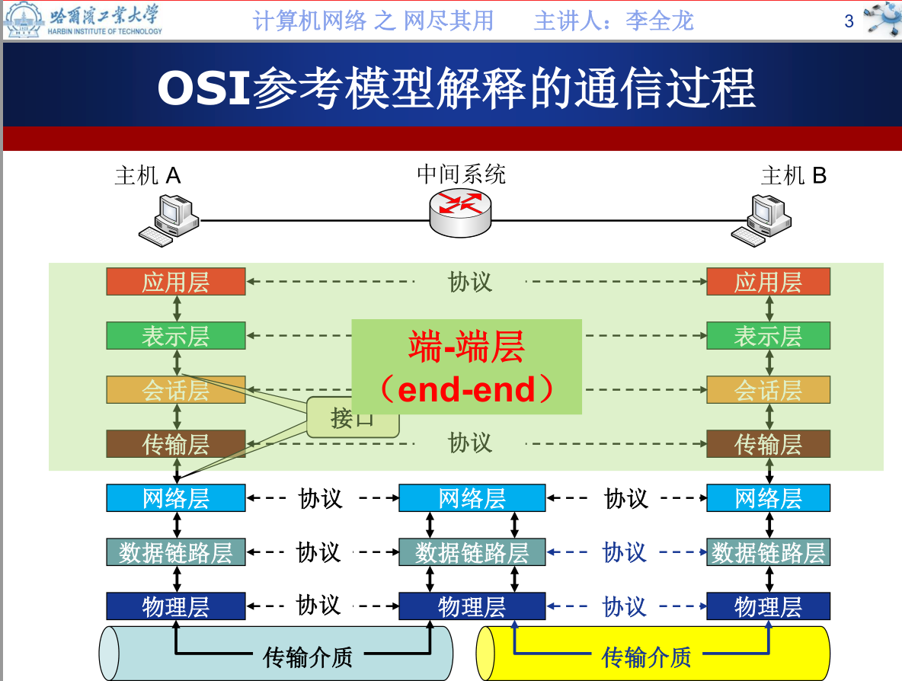

练习：互联网标准有哪几个重要组织和协议？

1.  链路层

链路层的任务是组成通信链路并尽可能快地传输信号。链路参与的设备有网卡、通信介质、转发器、网桥、交换机等。网卡是主机管理的网络适配器，负责编码解码收发信号，信号通过通信介质传播，转发器在通信链路中复制放大信号，集线器有多个端口，可以转发多条线路，交换机拥有控制端口的功能，可以用于组成不同的vlan子网。

常见的信号载体有电缆中的电流、光纤中的激光、天线收发的无线电，而今光纤因为频高带宽、稳定抗干扰成为主干介质，便宜方便的电缆连接家庭终端，无线电尤其是wifi覆盖着移动生活全方面。二进制信号可以用电位、差分电位、调幅、调频、调相表示，在较高频率中采用调相+调幅的正交振幅调制QAM，以追求更高的传输速率，更宽容的容错空间。若QAM的相位有12种，每种上面振幅有两种，则一个动作，也就是一个码元，能携带24位信号，对于精度要求是很高的，也适合当今技术条件。

抗干扰的差分编码：CPU中常用低电平表示0，高电平表示1。网络通信中没有这么好的条件，所以采用差分编码，用电平的相对变化表示一个位，例如manchester差分编码用向上表示0，向下表示1，如果受到一个干扰，高低电平会向同一方向上移动，仍然能够保存信息，代价是变化次数多了一倍。

信号承载的极限速率

Nyquist准则给出了码元的极限密度。波特率=2W（（Baud）。W是理想信道的带宽，单位为赫(Hz)；码元传输速率的单位是Baud（波特），码元//秒。

信息传输速率的上限值：比特率=2Wlog2L（（b/s）。L为信号电平数量；数据传输速率的单位是b/s（比特//秒）。

Shannon公式给出了存在噪音的情况下信息密度。信道的极限信息传输速率C可表达为C=Wlog2(1+S/N)b/s。W为信道的带宽（以Hz为单位）；S为信道内所传信号的平均功率；N为信道内部的高斯噪声功率。

信道复用是分组交换的物理基础，信道可以在时间上，频段上、编码上分用给不同的数据包来实现复用，解决了链路的独占性。

基础传输对位的分块单位是帧，封装的帧采用循环冗余编码CRC检验是否出错，中继器对正确的帧反馈确认，发送方会重位成功的帧，来保证可靠性。

链路的编址是给每个网卡分配一个唯一的硬件地址，叫mac地址，每个接通的设备只需要记住跟自身插口相连的对方设备mac地址。mac地址有48位，由W-IEEERA分配至各个厂商，厂商给硬件分配一个唯一的mac地址。能识别插口的设备都有独立的mac地址。一般硬件的mac地址出厂后固定不变，若变动则被视为新设备。

基础传输的信号由主机网卡生成，对二进制数据流加上帧头部尾部后封装成帧，帧由集线器、交换机中继，跟据mac硬件地址寻址。

数据帧采用滑动窗口来回复确认，接收方的窗口存储着发送池的帧编号。接收方的窗口存储着接收池的帧编号，返回一个连续正确接收的最大帧号。发送方收到回复确认帧号便知此号之前的帧都已成功发送，剩下的帧有已发送等待确认的，等待发送的。过一阵子还没有道确认的帧就重传，接收方等不及发送方补漏也可以主动要求重传指定某些帧。滑动窗口规则对双方交互来说很简便，可以迅速调整速率，提高信道利用率。

思考：确认帧号是在下一个要顺风帧中捎带确认的，称之为捎带确认。为什么不将确认帧号组加入帧数据回复？为何不专门答复？

常用的是点对点通信的PPP协议和广播通信的CSMA/CD协议。

点对点通信

ppp协议用于点对点传输，传输家庭终电脑连接到ISP。PPP协议简单高效，支持多种链路和多种网络层协议。ppp帧格式=5字节头部+可选最长1500字节IP数据报+2字节尾部。头部尾部没有地址，都是控制信息，可以实现链路建立和终止，承载上层交流。

广播通信

常见的局域网中的主机通过总线、集线器连接，中介的信号每一个终端都能收到，构成一个广播域。这种广播域现在常见的是以太网，范围小，数量小，一个单位管理。广播域需要解决的任务有信道划分、随机接入、受控介入功能，既要保证平等高效通信，又要防止冗余广播。主机每发一个信号，都是的邻居主机的广播，如果同时发信号，会产生信号碰撞。CSMA/CD协议的办法是每个主机都在监听，只允许一个主机发信号。如果想发送，需要先广播询问信道。如果检测到碰到，就发送一个碰撞信号后沉默，经过退避期后继续询问信道，无碰撞才开始发送数据。局域网范围小，甚至一个学校就有很多个，可以为了简单方便忍受短暂的退避期。mac帧常见的是以太网v2标准，mac帧格式=6字节目的地址+6字节源地址+2字节类型+IP数据报+FCS校验。

思考：什么时候需要通信编码需要纠错码，什么时候只需要校验码？

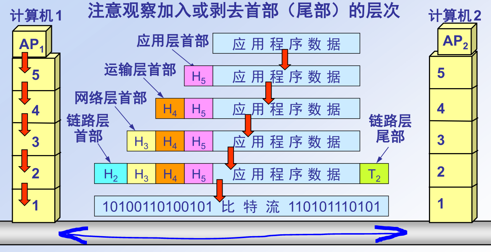

此类图片来源于谢希仁《计算机网络》配套ppt

1.  路由层

路由层的任务是在主机层和链路层之间组网，并选取最佳路径传播，最佳路径通常是最短的，最便宜的，或者传输速率最高的。现今网络中连接的主机以亿万计，呈现更多的水平连接特征。主机与主机之间很少专门架设一条链路，而是网状链接，产生的通讯链路更不计其数。为此有必要为主机层和链路层都给抽象编址，路由层适配二者，并选取最短路径，这工作主要由路由器完成。路由器是主机之间的中介设备，要求尽可能便宜。电信网中的中介设备是昂贵复杂程控交换机，负责建立链路，保障可靠连接。计算机网网络中路由器只负责选取最短路径，可靠连接的重任由主机层完成。路由层只提供简单灵活的、无连接的、尽力交付的数据报服务。交换机只能被指定端口与谁相连，不能存储分组。路由器可以将分组存储，在合适的时间从主动选择的最短路径发出。路由器这种存储转发的独立性，极大地增强了中介健壮性。

主机的编址是采用IP协议。现在流行的IPv4有32位，正在向128位的IPv6切换。由ICANN按块分配给各个ISP，各个ISP再将IP段分配给联网的网关，各级网关上的路由器向每一台连接互联网的主机分配一个唯一的IP地址。IP是可变的，每一个分配的IP都能根据前几位大致确定位置。路由器的每一个端口需要被寻址，都要给一个IP编码。默认局域网路由器的网关地址是192.168.1.1.
127开头的IP是本地网络，192.168开头的IP是局域网，一般IP才表示连接上互联网。为了更灵活地划分子网，不一定要求同一个网关管理，有相同子网掩码的也算统一子网。常见子网掩码是255.255.255.0.

练习：ipv4地址有多少，ipv6地址有多少?为什么要采用ipv6这种不兼容方式拓展寻址空间，而不是多级编址？宇宙间通信需要如何设计编址?

特殊的IP地址前缀，？表示[0,255]区间

| 二进制表示                             | 十进制表示  | 含义               |
|----------------------------------------|-------------|--------------------|
| 0111 1111 0000 000 0000 0000 0000 0001 | 127.0.0.1   | 本机地址           |
| 1100 0000 1010 1000                    | 192.168.?.? | 常见本地局域网地址 |

练习：windows中打开cmd程序，输入ipconfig命令

寻址的办法是，每一台路由器都有一个路由表，存储着不同IP的交付邻居地址，通过路由器接力传到目的主机。路由器接收到主机的数据报，检查其中的目的地IP，如果是本路由器管理的IP，则登记过其硬件地址，直接从相应的接口发送给主机；如果是本层路由器管理的IP，则从最短路径交给邻居；如果是上层路由器管理的IP或者位置IP，则交付给上层网关。所以，路由器要实现这些功能，需要解决的问题有：登记所管理主机的硬件地址和连接状态、询问邻居的管理IP段和状态、求最短路径、与外部网络通信。这些路由器之间也是要互相报告询问的，众多路由器管理的子网可以组成一个大网，有更高级别的网关管理。

上述问题由一系列的路由层协议解决，主机的编址由IP协议解决，IP与mac对应的问题由地址解析协议ARP解决，路由器和主机的连接状态由网际报文控制协议ICMP解决，内部路由IGP中，小规模的网络用路由信息协议RIP解决，大规模网络用OSPF解决，外部路由EGP由BGP解决。

ARP协议

地址解析协议ARP(AddressResolutionProtocol)在本局域网中由主机自动使用，每一台主机都向相连的主机发送一个广播，报告本机IP和mac，经过所有主机的报告，每台都都能收到所有成员的IP和MAC的对应表。每十分钟更新，没有报告的主机被认为失联。

练习：windows中打开cmd窗口，输入arp命令

路由层的传输单元是IP数据报，由携带控制信息的头部+上层交付的数据部分组成。也是4字节对齐的。重要的解释有标识，是分组的ID，相同的标识数据报们会在接收后组合为一个数据包；标志标识该IP数据报是被分片的，接收后应该放在片偏移位置上；生存时间用主机间经过的链路数量衡量，也就是跳转的路由器数量+1，也叫跳数。协议的值有ICMP、UDP、TCP，指明数据表应该交给谁处理。一个路由器接收IP报后:揭开头部；校验首部，校验出错就抛弃；跳数减一，跳数为零就抛弃。这里为了高速运转只校验首部，数据校验由主机完成。

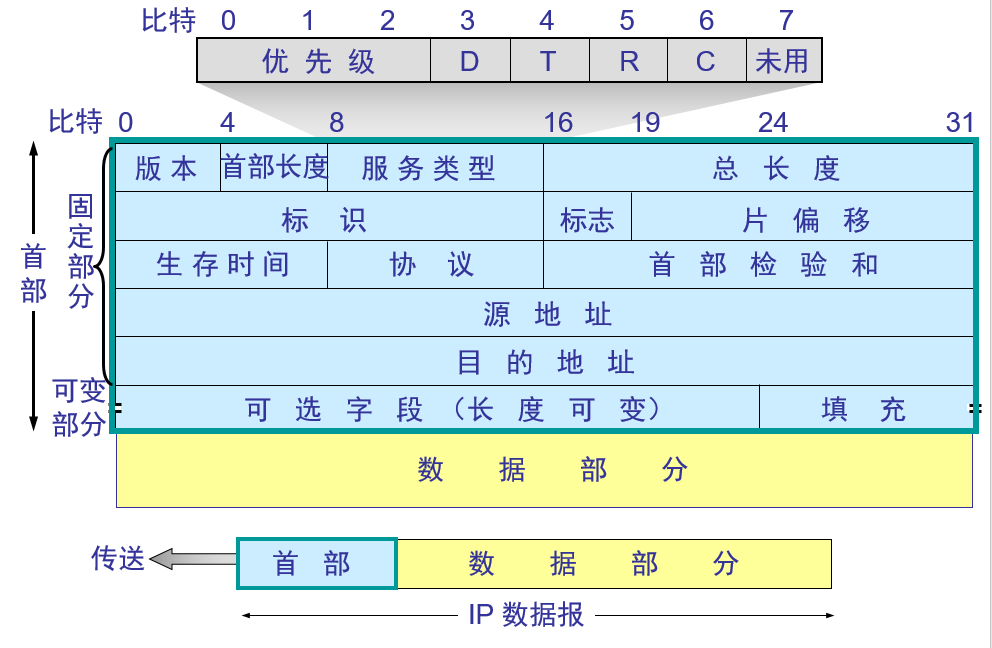

ICMP网际网控制报文协议 ( Internet Control Message
Protocol)，用于检测链路状态和控制，让路由层具备控制功能。下图是一个ICMP响应报文，其中的数据部分截取了问候报文的前一截，表明相应的是该问候报文。

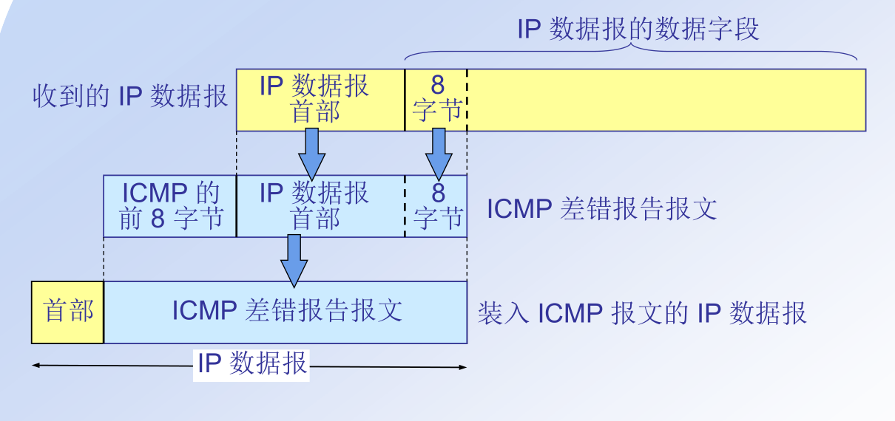

ICMP可以报告的信息有：终点不可达、抑制源点、超时、参数错误、重定向

练习：ping cyuer.org tracert mail.cyuer.org (tracert是什么的缩写？)

路由协议，是为了求最短路径问题，当然也可以指定路由。设计模型的时候都会留有手动空间，以应付意外情况。一般情况下会按照协议模型自动配置。小规模局域网使用简单的RIP协议，规模稍大一些的重要网络使用性能更突出的OSPF协议。每一个网关所管理的网络都构成自治域，自治域之间使用BGP协议路由，多个邻接的自治域构成更大的母网，由更高层次的网关管理。通过分层自治实现了亿万台主机相连的互联网。

RIP协议

RIP协议routing information
protocol，是内部网关协议中最早流行的协议。是一种分布式给予距离向量的路由选择协议，采用距离向量路由算法(Bellman-Ford
Routing Algorithm)，也叫做最大流量演算法(Ford-Fulkerson
Algorithm)。相当简单，适用于小局域网。这里距离用跳数衡量。这个小局域网中路由器按照RIP协议通信，经过一段时间后每一台路由器都会获得到达整个网络的最短路径。第一步邻居探测:每30秒路由器向邻居发送RIP报文，受到响应后和存储一张邻居表，没回信的端口会标记失效，用跳数16表示。需要存储的信息有：本机IP，邻居IP，端口m，跳数1。这里在更宏观的领域使用IP寻址，确定IP之后再根据mac寻址。因为IP是全球性的，可以跨越多个路由定位，mac只知道直接相连的硬件。第二步距离探测：路由器将邻居路表由广播给邻居，也会收到各个邻居发来的邻居表。获得这个邻居表可以起到两个作用:1.邻居路由连接哪些IP地址；2.如果有多个路径到达统一目标IP，更新为更短的路径。此时路由表需要存储:本机IP、目标IP、下一跳IP。路径是经过一个个路由器到达的，这里没有存储一条完整的路径，而是存储较短路径上的下一个节点，在下一个节点上获知再下一个较短路径。这样减少了存储长度，缩短了冗余信息，提高了健壮性，不会因为某一结点失效而导致整条线路失效。代价是线路不一定是最短的，不过路径长度会随着距离探测的迭代缩短，所以是值得的。

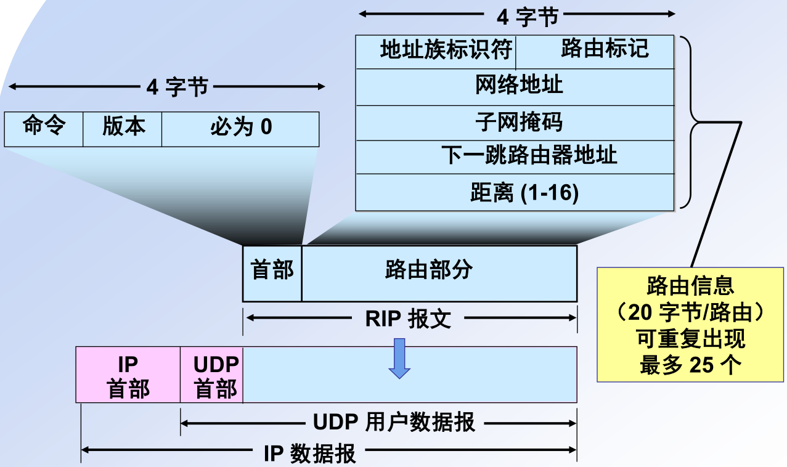

RIP的报文格式跟ICMP很像，不同的是ICMP是检测链路状态，RIP是为了计算最短路由。路由器获得RIP报文中的数据部分会计算后添加到自己的路由表中。

练习:查询路由器的RIP表，实现RIP算法。

OSPF协议

open shortest path
first，使用了分布式链路状态协议，使用Dijkstra算法查找最短路径。RIP协议简单，收敛速度慢，OSPF解决了这个问题，相应地，更复杂，开销更大。RIP协议中的路由器仅仅与邻居路由器通信，OSPF中路由器采用洪泛法向所有路由器报告，报告其与所有邻居的相连状态，经过数次迭代之后很快能建立一个链路状态数据库，最终全网路由器都能获得全网拓扑结构图。可见其计算量大，收敛速度快。拓扑完成后，只有链路状态变化或者30分钟后才洪泛一次，每个路由器负责监测直连的链路状态。OSPF适用于大规模自治系统的内部，一个OSPF网内路由器通常少于200个，更多的话需要分层架构。路由器通过巨大的计算求出最短路径，来减少整个网络上的通信量。

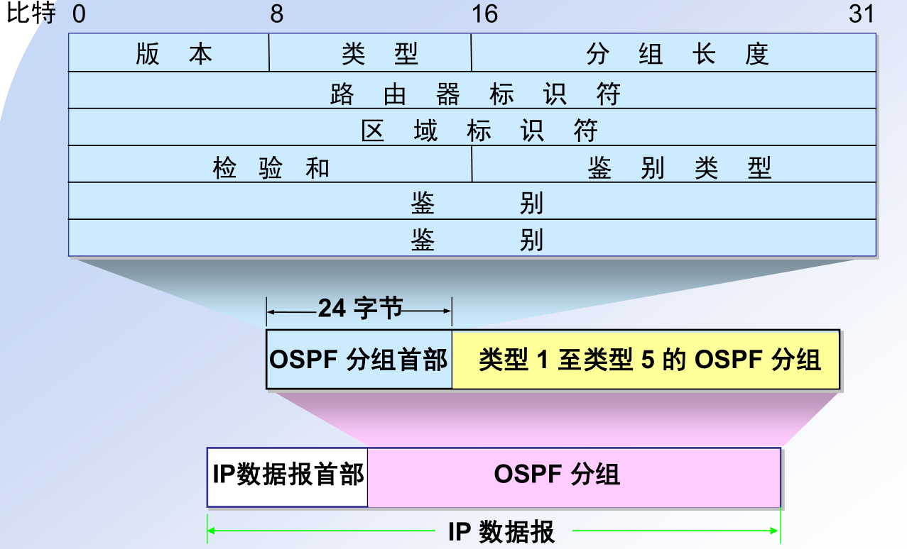

OSPF生而为高效服务的，直接使用体积较小的IP数据报。不同的动作加载于五种类型分组中，分别是问候分组、数据库描述分组、链路状态请求分组、链路状态更新分组、链路状态确认分组。强劲的性能和丰富的信息可以支持复杂的业务，例如负载均衡。

练习：查找路由器的路由表，实现Dijkstra算法。

BGP协议

从上层的母网看来，下面每一个子网都是自治域。自治域与外界的路由通信协议使用的是BGP协议。每个自治域由网关指定一个路由器作为本自治域的发言人，负责与外界沟通。自治域发言人与邻居自治域发言人或者上级网关使用BGP通信，通信量小且重要，使用TCP报文

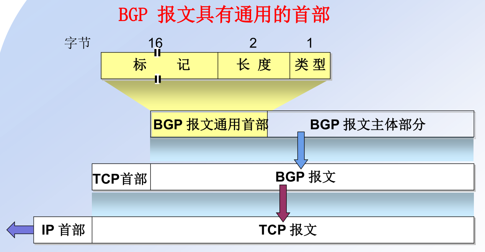

类型主要有：打开连接、更新、保持、通知。通过这几个动作将本网的路由信息报告给邻居。

1.  主机层

虚电路可以提供持续连接，历史实践的结果是主机层才余力建立，直到此时才会有可靠交付。主机层可以直接承载进程传过来的数据。一条主机层的连接并没有采用\<ip,进程ID\>来描述，而是在进程与IP之间加了一个抽象层端口，每一个端口都被唯一进程使用，软件上端口易于更改和遮蔽，是一个很好的缓冲层。所以描述连接使用插口\<ip，端口\>，也叫套接字。

常见的通用端口：

| 协议   | 16位端口的十进制表示 | 用途          | 底层协议 |
|--------|----------------------|---------------|----------|
| FTP    | 21                   | 文件服务器    | TCP      |
| SSH    | 22                   | 远程登录      | TCP      |
| TELNET | 23                   | 远程登录linux | TCP      |
| DNS    | 53                   | 域名记录      | UDP      |
| HTTP   | 80                   | web服务       | TCP      |
|        | 3306                 | mysql数据库   | TCP      |
|        | 50000-65000          | 程序开发私用  | TCP/UDP  |

主机层主要有两种协议，依旧使用无连接不可靠的是简单高效的UDP协议，面向连接的可靠的复杂的协议放在TCP实现。

UDP协议User Datagram Protocol
(UDP)只管一次发送，没有连接，控制头部也比较小，开销小，发送后不管。只校验头部。

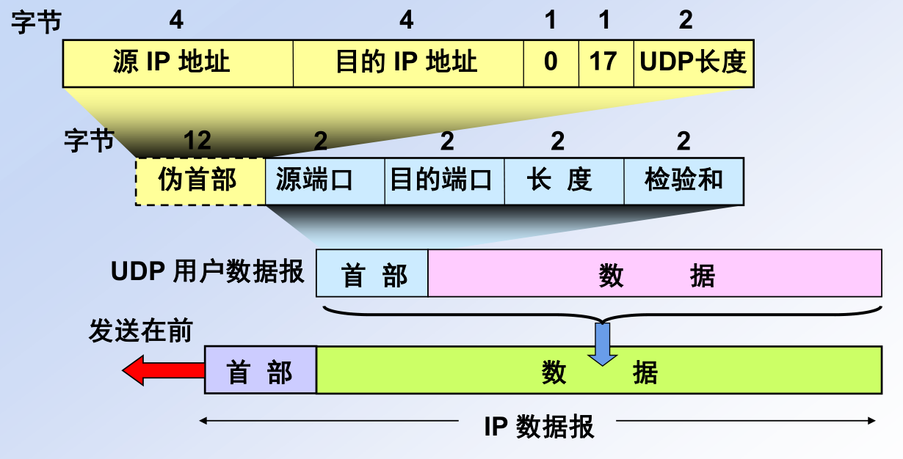

TCP协议

可靠交付的主要重任落在TCP协议上。要实通信可靠，就必须要有回信，长久的回信UDP也能做到，那只能事后才知道。即时的回复需要在一条双向通信的电路上，有即时的回复才认为是可靠的交付。TCP协议就是无连接的IP数据报上，构建出一条持续链接的虚电路，对发送的TCP报文回复确认，来保障可靠交付。之所以称其为虚电路，是因为它构建于分组交换的基础上，能够即时双向通信的线路，非常类似于电路交换，用分组交换的成本来实现电路交换的功能，代价是控制信息多、实现复杂。

可靠交付所需要解决的问题有连接的建立和释放、差错控制、拥塞控制。不可靠的传输中只能通过回信来确认正确传输，无回信、回信错误、超时一律认为错误。

练习：Berkeley套接字描述了几个动作：socket、bind、listen、accept、connect、send、receive、close，请插入到下面对应表格中。

连接的建立

连接的建立需要双方都发送建立的意愿、双方都收到对方的意愿、双方都准备通信。

客户机作为主动方，服务放作为监听方。建立连接最少需要三次握手，当server收到报文3后双方才算相知。server在第二步就准备连接，开销比client早一步，要防止被用于攻击。

| client动作 | client发送报文                 | server发送报文                  | server动作          |
|------------|--------------------------------|---------------------------------|---------------------|
| 准备连接   | \-\>报文1：请求通话            |                                 | 监听                |
|            |                                | 报文2：收到语句1，已准备通话\<- | 准备连接            |
| 建立连接   | \-\>报文3：收到语句2，连接建立 |                                 | 收到报文3即建立连接 |
|            | 互通有无                       | 互通有无                        |                     |

思考：相知需要双方各自问候，并能收到答复，总计四次握手，这里为什么只需要三次？四次挥手还可以压缩吗？

连接的释放

类似的，连接的释放也需要三次挥手才需要双方相知。挥手之前要确认数据传输完毕，需要三次拍手。生活中，如果不请客吃饭的话，挥手是紧跟着拍手的，小气的TCP当然不放过这个抠门的机会，代价就是要在TCP报文中增加字段。短连接中，拍手挥手可以压缩成4次挥手。长链接中，维持连接的心跳包代替了拍手，也可以用统一的四次挥手形式。

TCP是网络通信少见的昂贵开销了，这里还可以压缩成四次挥手。四次挥手中不需要专门报告相知无发送任务、相知接收任务完成、相知请求关闭。只需要相知发送完毕就关闭。TCP连接中总是及时地报告自己没有发送任务了，以便尽早地释放连接资源，如果要维持连接，需要不断发送心跳报文；如果不想维系，每次发送完毕都会准备释放连接。只要双方互知无发送任务，即断开连接；收到无发送任务报告的时候，接收任务早已完成。两步时间本来是两个最长报文寿命，也可以指定时间。

| client动作       | client发送报文                                   | server发送报文               | server动作           |
|------------------|--------------------------------------------------|------------------------------|----------------------|
| 进程不再发送数据 | \-\>报文1：client数据发送完毕，请求关闭          |                              |                      |
|                  |                                                  | 报文2：收到报文1\<-          | 进程不再监听接收数据 |
|                  | 等你一会儿                                       | 稍等一会儿                   |                      |
|                  |                                                  | 报文3：server数据发送完毕\<- |                      |
|                  | \-\>报文4：收到报文3，若无异议两步时间后释放连接 |                              | 收到报文4即释放连接  |
| 释放连接         |                                                  |                              |                      |

练习：写出三次拍手、三次挥手交互图。断点调试这些步骤，截断或超时其中一条消息，看双方如何应对？这些信息需要几个在TCP头部添加几个控制位存储?

差错控制

丢报文：有效的回复确认才算是传送成功，需要给TCP的分组编码，如果受到该编码的反馈，表示成功发送该TCP报文。没有收到反馈则重传。自动重传请求使得发送方肩负着差错记录的责任。

报文差错：头部和数据部分按照2字节对齐，校验结果放在头部校验和中。有差错仍然丢弃。如果TCP的数据校验也不堪重任，还可以由主机进程校验，或者底层采用更抗干扰的编码。

TCP控制的颗粒度很细，发送方把TCP报文编码成字节流发送，接收方按照字节流的编号确认。TCP头部UDP头部携带的信息多，序号的步长是数据部分所携带的字节数。序号是TCP字节流中字节的编号，确认号之前的字节都已经成功发送，现在要从该序号开始发送。接收方只能允许发送方发送[确认号，窗口号]的字节流。URG、ACK、PSH、RST、SYN、FIN这几个特殊位表示特殊控制和连接的建立释放。

思考：答复一个最大确认号只能携带部分字节确认信息，确认号组加入数据部分反馈主机解析能反馈TCP报文中每一个字节的确认信息，效果与成本相差多大？

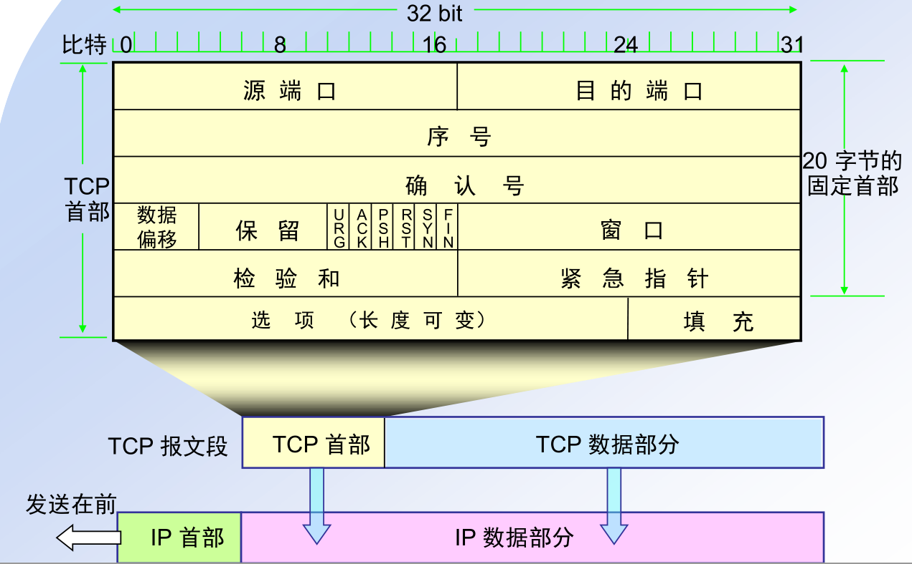

流量控制

字节流作为即时回复的分组单位稍显小，但用于速度侦测就很适合。滑动窗口很形象地描绘了发送缓冲池和接收缓冲池的动态调整。发送方把缓冲池的字节流分成已成功发送、待回复确认、可以发送、等待发送。发送方发送一系列的字节流，接收方若收到连续完整的字节流，则反馈最高字节流编号。接收方把收到的反馈编号之前的字节流标记为成功发送。等待确认的字节可能是在发送途中，可能是在接收方因为乱序而重组过程中，也可能是确认号归途确认中，过一阵子大概是5倍往返时间再重传。可发送的字节流是双方和路由网络都能容纳的字节流空间。待发送的是现在还不能发送的字节流。

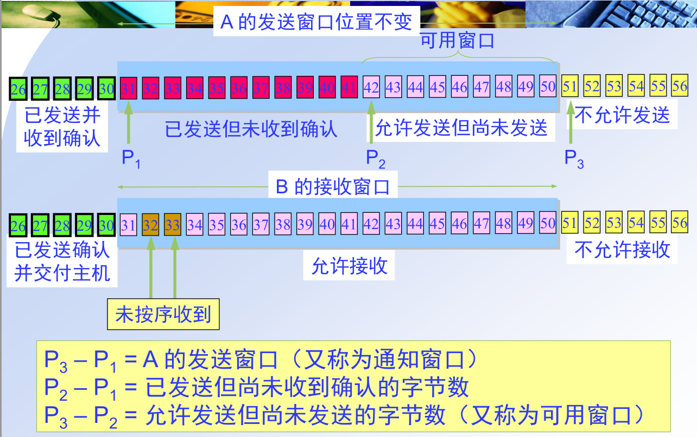

发送方只知道要发送的数据量和自己的缓冲池，TCP链路上的速度和缓存不太好控制，接收方的缓存和处理速度也不太好控制。所能依赖的，只有接收方反馈的确认号。解决的办法是慢增长、快下降。一开始的速度慢一点，如果能正常收到确认号，就逐渐增加发送速率，如果遇到阻塞，确认号回复变慢，就迅速降低发送速率。滑动窗口的大小也是根据回复确认号的来定的，回复的确认号很快很大，就多发送一点；收到的确认号慢、小，就发送少一点；迟迟没收到确认号，就重传。

1982年 Dave
Clark一句话，可以说揭示了TCP/IP早期的哲学，以及在当时环境下TCP/IP获得成功的秘诀：“We
reject kings, presidents, and voting.We believe in rough consensus and running
code.”

1.  网络应用

进程产生的数据交给TCP或者UDP发送，一般的应用开发只需要掌握HTTP协议，url格式，其他具体知识需要的时候再学习。几个重要概念如下。

DNS在商业上的应用非常大，DNS协议让域名与IP对应，用户只需要记住DNS而不是IP，一般最值钱的都是.com域名。URL
<http://cyuer.org:80/index.html> 的链接格式是协议名://域名:端口号/文件路径。

练习：搜索一个whois查询网站，查找pku.edu.cn的dns记录，解析其含义。

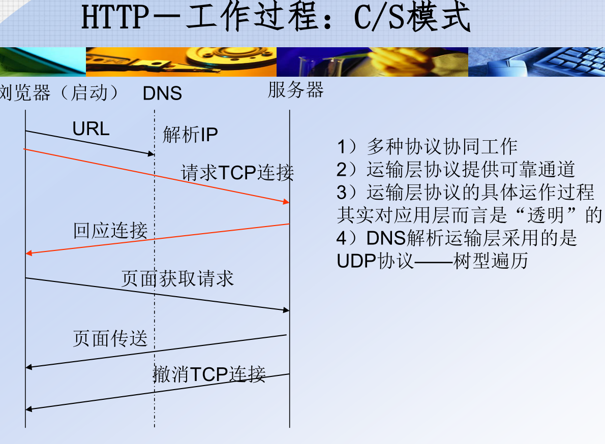

现在最常用的HTTP1.1 的请求方法有GET:请求读取由URL所标志的信息，POST:
给服务器添加信息, PUT: 在指明的URL下存储一个文档..

HTTP请求报文的例子

GET /chn/yxsz/index.htm HTTP/1.1
//使用HTTP1.1协议，请求返回/chn/yxsz/index.htm文档

Host: [www.](http://www.)cyuer.org //请求链接的主机

Connetcion: close //传送完成可以释放连接

User-Agent: Mozilla/5.0 //客户端是火狐浏览器

Accept-Language: cn //优先传送简体中文

最常见的响应码是:

HTTP/1.1 202 Accepted

HTTP/1.1 400 Bad Request

HTTP/1.1 404 Not Found

HTTP/1.1 301 Moved Permanently

Location tif.world //重定向至新链接

HTTP仍然是无连接的。为了服务器获知客户端状态，采用cookie和session技术。

从安全上考虑，浏览器被设定为不可读写本地文件，服务器可以写入读取cookie，浏览器将cookie保存在浏览器管理的文件中，网站服务器只能读写本域名的cookie。服务器还可以在本机的session上存储客户端的信息，可以设定，若30分钟后客户机无响应，
标记为断开连接。火狐浏览器打开一个你经常登录的网站，右键查看页面信息-\>安全-\>cookie，cookie的值能否读懂，思考为什么要这样设计？

访问的网页使用html标记语言编写，
叫做www协议，采用http协议传输。启动火狐浏览器，输入cyuer.org，空白处右击查看源代码，可以了解到html的文档格式，有可能看到设计装饰用的css标记语言，还有运行脚本的JavaScript程序语言。index.php表示该网页是使用php程序自动生成的。www协议中，服务器上的程序生成html文档，经过http传输到客户端浏览器，浏览器再渲染出html效果图呈献给面前的你。

练习:
搜索wamp一个软件套件，例如phpstudy，根据指示启动，在浏览器输入<http://localhost/>，正常的话会出现一个页面，表明你的电脑已经成为一台服务器，将本机的ipv6地址或者ipv4局域网地址传到手机上，也可以访问。用vscode打开网站目录中的index文件，任意更改文件中的字符并保存，在浏览器中刷新查看效果。Phpstudy的操作很很有限，几个按钮多试几次就能成功。

Wamp是windows+nginx+mariadb+php的缩写，一台服务器需要操作系统，常见的是unix、linux、windwos
server，http解析程序apache、nginx，动态生成html文档的程序php、java、python，数据库mariadb/mysql、postsql、oracle、db2、ms
sql
server。网站可以提供成千上网的网页，最长访问的网页会生成静态文件直接传给浏览器，大量的文档使用数据库中的数据和程序动态生成。

搭建自己的网站：在linode.com或者digitalocean.com上购买一个vps，vps是一台虚拟的计算机。使用github
education有digitalocean优惠码。大概付几十块钱后可以获得一台ubuntu系统的服务器，根据网站或者邮箱上的ip和root
密码，使用MobaXterm_Portable登录，安装宝塔控制面板。在mobaxterm左侧的文件浏览器找到网站网站根目录，传入worldpress根目录并打开主页安装。就可以做成自己的一个博客程序。还剩下最后一步域名，在godaddy.com
或者dynot.com
上购买一个域名，在nameserver中更改a记录，指向vps的ip。经过几小时后dns传递生效，便可以使用域名访问网站。
